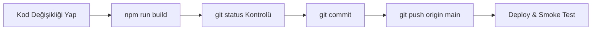

# Geleceğin Dijital Sağlık Liderleri — Operasyon Rehberi

Bu doküman, **Geleceğin Dijital Sağlık Liderleri** projesinin mimarisini, canlı ortam bilgilerini, Supabase serverless ve Edge Function altyapısını, güvenlik kurallarını, canlıya alma (deploy) ve operasyonel bakım süreçlerini teknik ekipler, proje sahipleri ve AI ajansları için detaylandırır.

---

## 1. Proje Durumu Özeti

Proje mimarisi, legacy Django REST API yapısından **Supabase Serverless / Cloudflare Pages / Workers Edge Functions** mimarisine kademeli ve güvenli bir şekilde aktarılmıştır:

- ✅ **Auth Bloğu**: Supabase Auth entegrasyonu tamamlandı.
- ✅ **RLS (Row Level Security)**: `SEC-02` RLS politikaları ve `QA-02` detaylı RLS test matrisi **%100 PASS** ile doğrulandı.
- ✅ **Admin Paneli**: Temel veri okuma Supabase Client'a, kritik işlemler (`approve_candidate`, `reject_candidate`, `create_mentor`, `delete_mentor`) `admin-actions` Edge Function'a aktarıldı. Performans ve DNA Analizleri sekmeleri Supabase Client'a taşındı (`DATA-05E`).
- ✅ **Katılımcı Paneli**: Temel veri okuma Supabase Client'a, İçerik DNA form submit ve Gemini AI rapor üretimi `ai-content-dna` Edge Function'a aktarıldı.
- ✅ **Mentor Paneli**: Temel veri okuma Supabase Client'a, revizyon isteme (`request_revision`) ve nihai değerlendirme/puanlama (`evaluate_delivery`) `mentor-actions` Edge Function'a aktarıldı (`DATA-07A`, `DATA-07B`).
- ✅ **CORS Sertleştirme**: Edge Function CORS wildcard (`*`) kullanımı kaldırıldı; canlı domain ve yerel portları içeren allowlist ile sınırlandırıldı (`SEC-03`).
- ✅ **QA & Test**: Rol bazlı canlı smoke test (`QA-01`) ve RLS güvenlik regresyon testi (`QA-02`) **PASS** verdi.
- ⏳ **Google Drive Bağımlılığı**: Dosya yükleme (görev teslim) ve `/media` link temizliği Google Drive API credential bilgileri (`GD-02`, `DATA-06B`, `DATA-WARN-01`) geldikten sonra tamamlanacaktır.

---

## 2. Canlı Ortam Bilgileri

- **Canlı Uygulama Domaini**: [https://gelecegin-saglik-liderleri.omerkarapinar.workers.dev](https://gelecegin-saglik-liderleri.omerkarapinar.workers.dev)
- **Supabase Project Reference**: `wczupupflxvfnjbjkfrj`
- **Cloudflare Pages / Workers Deploy Kaynağı**: GitHub `main` dalı.

> [!IMPORTANT]
> GitHub `main` dalına `git push` yapılmadan Cloudflare tarafında canlıya hiçbir kod değişikliği yansımaz.

---

## 3. Zorunlu Geliştirme Süreci

Tüm geliştirme, hata düzeltme ve refactor adımlarında aşağıdaki sıra eksiksiz uygulanmalıdır:



1. Kod değişikliğini yerel ortamda gerçekleştir.
2. Production derleme testi için `npm run build` çalıştır.
3. `git status` ile değişen dosyaları doğrula.
4. Anlamlı ve standartlara uygun commit mesajı oluştur (ör. `fix(...)`, `feat(...)`, `chore(...)`).
5. GitHub `main` dalına push et: `git push origin main`.
6. Cloudflare Pages ve Supabase Edge Function deploy durumunu doğrula.
7. Canlı ortamda smoke test gerçekleştir.

---

## 4. GitHub / Cloudflare Deploy Süreci

- Frontend kod değişiklikleri GitHub `main` dalına push edildiğinde Cloudflare Pages / Workers otomatik tetiklenir ve yeni statik bundle'ı derleyerek canlıya alır.
- Deploy tamamlandıktan sonra canlı login ve panel akışları taranır.
- Tarayıcı önbelleği (cache) veya eski asset sorunu yaşanırsa network sekmesinden yüklenen JavaScript bundle hash'i (`index-XXXXX.js`) kontrol edilir.

---

## 5. Supabase Yapısı & Mimari

- **Supabase Auth**: Kullanıcı kimlik doğrulama, JWT session yönetimi.
- **`profiles` Tablosu**: `auth.users` ile 1-1 eşleşen rol (`role`), ad-soyad, e-posta, `core_katilimci_id` ve `core_mentor_id` bağlantı tablosu.
- **Row Level Security (RLS)**:
  - **Katılımcı**: Sadece kendi profilini, kendi görev/teslim kayıtlarını, kendi DNA raporunu ve kendi performans verilerini görebilir.
  - **Mentor**: Sadece kendi takımını (`core_takim.mentor_id`), kendi takımındaki katılımcıları ve teslimleri görebilir.
  - **Admin**: Tüm yönetim tablolarını okuyabilir/yönetebilir.
- **Service Role Key Kullanımı**: `SUPABASE_SERVICE_ROLE_KEY` yalnızca sunucu/Edge Function ortamında kullanılır. Frontend istemci koduna **asla koyulmaz**.
- **Anon Key Kullanımı**: Frontend istemcide yalnızca `SUPABASE_ANON_KEY` kullanılır.

---

## 6. Kullanıcı Yönetimi & Güvenlik Kuralları

### Kullanıcı Oluşturma & Şifre Sıfırlama
- **Doğru Yöntem**: Supabase Dashboard UI veya sunucu tarafında Supabase Auth Admin API (`admin.createUser`, `admin.updateUserById`).
- ⛔ **YASAK YÖNTEM**: `auth.users.encrypted_password` alanına doğrudan SQL `UPDATE` yapmak kesinlikle yasaktır! Bu işlem şifre hash yapısını bozar ve kullanıcının canlıya giriş yapmasını engeller.

### Profil Bağlantı Kuralları
- `profiles.id` ile `auth.users.id` eşleşmelidir.
- Rol alanları (`role`): `'admin'`, `'mentor'`, `'katilimci'`.
- Mentor kullanıcılarında `profiles.core_mentor_id` alanı ilgili `core_mentor.id` kaydı ile bağlı olmalıdır.
- Katılımcı kullanıcılarında `profiles.core_katilimci_id` alanı ilgili `core_katilimci.id` kaydı ile bağlı olmalıdır.

---

## 7. Edge Functions Listesi

| Edge Function | Amaç | Yetkili Roller | Yazdığı Tablolar | Gerekli Secret'lar | Deploy Komutu |
|---|---|---|---|---|---|
| **`admin-actions`** | Aday kabul/red, mentor kullanıcısı ve profil oluşturma/silme | Admin | `core_aday`, `core_katilimci`, `core_mentor`, `profiles`, `core_katilimciperformans` | `SUPABASE_URL`, `SUPABASE_SERVICE_ROLE_KEY` | `npx supabase functions deploy admin-actions --project-ref wczupupflxvfnjbjkfrj` |
| **`ai-content-dna`** | Katılımcı İçerik DNA form yanıtlarını alma, Gemini AI ile analiz üretme | Katılımcı, Admin | `core_icerikdnatesti`, `core_katilimci`, `profiles`, `core_katilimciperformans` | `SUPABASE_URL`, `SUPABASE_SERVICE_ROLE_KEY`, `GEMINI_API_KEY` | `npx supabase functions deploy ai-content-dna --project-ref wczupupflxvfnjbjkfrj` |
| **`mentor-actions`** | Mentor revizyon isteme ve nihai değerlendirme/puanlama | Mentor, Admin | `core_teslim`, `core_teslimhareketi`, `core_katilimciperformans` | `SUPABASE_URL`, `SUPABASE_SERVICE_ROLE_KEY` | `npx supabase functions deploy mentor-actions --project-ref wczupupflxvfnjbjkfrj` |

---

## 8. Edge Function Deploy Komutları

Supabase Edge Function değişiklikleri yapıldığında aşağıdaki komutlarla canlıya deploy edilmelidir:

```bash
npx supabase functions deploy admin-actions --project-ref wczupupflxvfnjbjkfrj
npx supabase functions deploy ai-content-dna --project-ref wczupupflxvfnjbjkfrj
npx supabase functions deploy mentor-actions --project-ref wczupupflxvfnjbjkfrj
```

---

## 9. Supabase Secrets Yönetimi

Supabase Dashboard / Secrets üzerinde tanımlı ve beklenen ortam değişkenleri:

- `SUPABASE_URL`
- `SUPABASE_SERVICE_ROLE_KEY`
- `SUPABASE_ANON_KEY`
- `GEMINI_API_KEY`
- `GOOGLE_SERVICE_ACCOUNT_JSON` *(Bekliyor)*
- `GOOGLE_DRIVE_ROOT_FOLDER_ID` *(Bekliyor)*
- `GOOGLE_DRIVE_SHARED_DRIVE_ID` *(Bekliyor - Opsiyonel)*

> [!CAUTION]
> - Secret değerleri ve `.env` dosyaları GitHub reposuna **asla commit edilmez**.
> - Google Service Account JSON içeriği veya private key ifadeleri frontend koduna **asla eklenmez**.

---

## 10. Google Drive Bekleyen Adımlar

- `GD-01` kapsamında Google Drive mimari tasarımı, secret isimleri ve `.gitignore` kuralları tamamlanmıştır.
- `GD-02` görevinin başlayabilmesi için yönetici tarafından `GOOGLE_SERVICE_ACCOUNT_JSON` ve `GOOGLE_DRIVE_ROOT_FOLDER_ID` bilgilerinin verilmesi gerekmektedir.
- Service Account e-posta adresi hedef Google Drive klasörüne **Editor** (Düzenleyen) yetkisiyle eklenmeli ve Google Cloud Console üzerinden Google Drive API aktif edilmelidir.

---

## 11. Test Kullanıcıları

| Rol | E-posta Adresi | Şifre Bilgisi |
|---|---|---|
| **Admin** | `omer@markamutfagi.co` | *Şifreler Supabase Auth üzerinden yönetilir. Gerekirse Dashboard veya Admin API ile resetlenir.* |
| **Mentor** | `mentor-test@gdsl.com` | *Şifreler Supabase Auth üzerinden yönetilir. Gerekirse Dashboard veya Admin API ile resetlenir.* |
| **Katılımcı** | `katilimci-test@gdsl.com` | *Şifreler Supabase Auth üzerinden yönetilir. Gerekirse Dashboard veya Admin API ile resetlenir.* |

---

## 12. QA Checklist

Sistemde büyük güncellemeler yapıldıktan sonra aşağıdaki testler taranmalıdır:

- [x] Admin Login & Panel Okuma
- [x] Katılımcı Login & Panel Okuma
- [x] Mentor Login & Panel Okuma
- [x] Admin Actions (Aday Kabul/Red, Mentor Ekleme/Silme)
- [x] Katılımcı DNA Submit (Gemini AI Rapor Üretimi)
- [x] Mentor Revizyon İsteme (`request_revision`)
- [x] Mentor Nihai Değerlendirme (`evaluate_delivery`)
- [x] Role Mismatch Engellemesi (Katılımcı → Admin/Mentor 403)
- [x] CORS Allowlist Doğrulaması (Yetkisiz Origin 403)
- [x] RLS Izolasyonu (Katılımcı / Mentor başkasının verisini okuyamaz)
- [x] Network Legacy Endpoint Kontrolü (`/api/login`, `localhost:8000` çağrısı olmamalı)

---

## 13. Bilinen Bekleyen İşler

| Görev Kodu | Görev Tanımı | Bağımlılık / Durum |
|---|---|---|
| **`GD-02`** | Google Drive Test Upload Edge Function Geliştirme | Google API Credential Bekleniyor |
| **`DATA-06B`** | Katılımcı Görev Teslim Akışının Drive'a Bağlanması | `GD-02` Bekleniyor |
| **`DATA-WARN-01`** | `/media` ve `teslim_dosyasi` Linklerinin Drive URL'ine Dönüştürülmesi | `GD-02` Bekleniyor |
| **`DATA-CSV-01`** | Admin Toplu Aday CSV İçe Aktarma Akışı | Planlama Aşaması |
| **`DATA-SHEETS-01`** | Google Sheets Canlı Senkronizasyon Akışı | Planlama Aşaması |
| **`DATA-SOFTDEL-01`** | Mentor Soft Delete İyileştirmesi | Planlama Aşaması |
| **`QA-03`** | Canlı Dosya Yükleme & İndirme QA Testi | `DATA-06B` Bekleniyor |
| **`QA-04`** | Django Kapalı Uçtan Uca Tam Test | Tüm DATA Görevleri Sonrası |
| **`CUT-01`** | Legacy Django Kodlarının Tamamen Temizlenmesi | Proje Kapanış Aşaması |

---

## 14. Hata Durumunda İlk Bakılacak Yerler

1. **Cloudflare Deploy**: GitHub `main` push işlemi başarıyla tamamlandı mı?
2. **Asset Cache**: Tarayıcıda eski bundle (`index-XXXX.js`) mı servis ediliyor? (Hard Refresh / Incognito dene).
3. **Supabase Edge Function Logs**: Dashboard → Functions → Logs sekmesinden hata stack trace'ini oku.
4. **Supabase Auth / Profiles**: `profiles.role` doğru mu? `core_mentor_id` veya `core_katilimci_id` bağlı mı?
5. **RLS Engeli**: Sorgu `0` kayıt dönüyorsa kullanıcı rolünün ilgili tabloyu read etme izni var mı?
6. **CORS Reddi**: Console'da CORS hatası varsa Origin allowlist'te yer alıyor mu?

---

## 15. Kesin Yasaklar

- ⛔ `auth.users.encrypted_password` alanına doğrudan SQL `UPDATE` yapmak yasaktır.
- ⛔ `SUPABASE_SERVICE_ROLE_KEY` veya Google Service Account Credential bilgilerini frontend koduna koymak yasaktır.
- ⛔ API key, secret veya şifreleri konsola/loglara yazdırmak yasaktır.
- ⛔ GitHub reposuna `.env` veya credential JSON dosyası commit etmek yasaktır.
- ⛔ Kod değişikliği yaptıktan sonra `npm run build` almadan ve GitHub `main` dalına push etmeden görevi tamamlandı saymak yasaktır.

---

## 16. Kapanış Notu

Google Drive API entegrasyonu dışında projedeki tüm aktif kullanıcı akışları Django REST API'den tamamen çıkarılmış ve Supabase Serverless mimarisine taşınmıştır. Drive credential bilgileri alındıktan sonra `GD-02` ve `DATA-06B` görevleriyle dosya yükleme akışı tamamlanacak ve Django servisleri tamamen kapatılacaktır.
